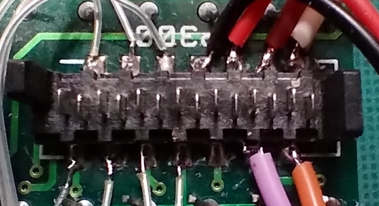

# LED Matrix Panel

Software to drive vinatge LED panels

Arduino sketch for Pro Mini board, uses TD6783AP high-side driver to drive LED anode banks. LED bit patterns are sent out using SPI device in micro feeding four chains of cascaded shift registers type 75HC595. The seven lines forming a single row of text aer sent sequentially, then a pause of 1mS to display the image formed. The four text lines are linterleaved so that all four first character lines are sent followed by all four second character lines and so on, this minimises the ammount of multiplexing needed, apart from time taken for additional processing each LEDS can be on for a maximum  of 1/7 of the total time. 

[Demo sketch](LED_Matrix_4Line_Demo/LED_Matrix_4Line_Demo.ino)

[Video](https://youtube.com/shorts/09ZpsXYtBmo?si=rDpB5rVtnLxmoRZ1)

The software is designed to drive four panels in cascade giving four lines of 240x7 LEDS. only a single panel has been tested so far. 

|LED Connector 1/2/3/4 |Name|Arduino Pin|Colour|
|----------------------|----|-----------|------|
|1|Clock|13|White|
|2|Latch|A2/A3/A4/A5|Orange|
|3|Enable|12|Brown|
|4|Data|11|Mauve|
|5|+ve|5v|Red|
|6|-ve|Gnd|Black|
|7|-ve|nc|n/a|
|8|Row 7|D2|Clear|
|9|Row 1|D3|Clear|
|10|Row 2|D4|Clear|
|11|Row 3|D5|Clear|
|12|Row 4|D6|Clear|
|13|Row 5|D7|Clear|
|14|Row 6|D8|Clear|

The signals to all four board connectors are paralled withthe exception to the text line latch signals, these are fed singly from the arduino A2/A3/A4/A5 lines. These connections or similar should be done by the board backplane or whatever is in the origianl housing.

Each line of text hhas a correcponding inpput and output connector. Most of the signalls are passed straight through from input to output. The data input terminal takes the serial data clocked by the clock signal. However the data pin on the output is from the end of the shift register chain ready for the next cascaded panel.

