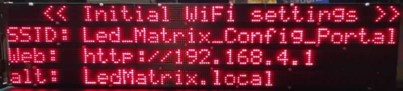
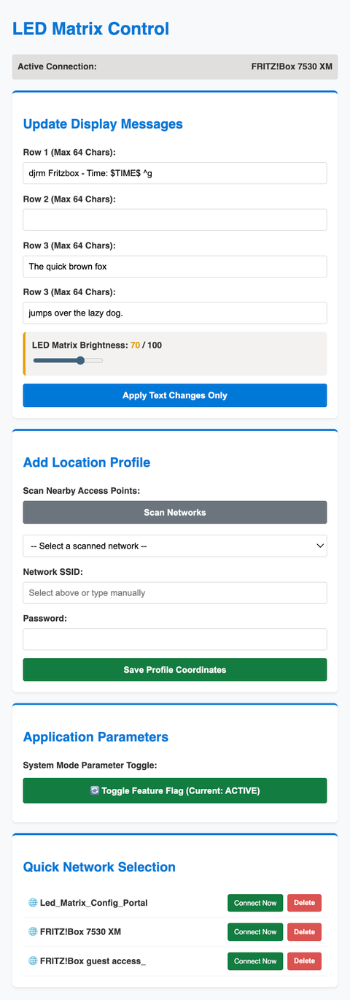
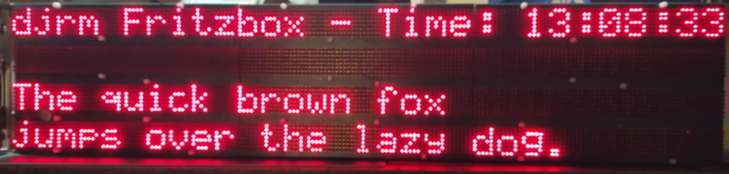

# LED Matrix Panel

Software to drive vinatge LED panels

## initial investigation

[Arduino Demo](ArduinoDemo.md)

## rp2040 pico-w full panel driver

The bus station led matrix display now has WiFi, initially it acts as a station which you can connect to to enter your local router details to make a permanent connection. 

When you have made a connection to the AP using the SSID shown, then opened the web page at the address given a menu of options is presented:

In the menu you can scan for local wifi networks and select new text to appear on the display, special text substitutions exist ^g to ring the external bell, and $TIME$ to show the time from a time server. Here the display updated with the text from the configuration:

Any connected wifi station holds its own panel variables, including text and brightness, the actual station can be chosen in the webpage but a scan of available station is used to choose the station to connect to at boot time, the default is the initial configuration access point. The system can be configured to simply only display the initial text if no wifi is available, all the adjustable settings and the web page are held in files on the micro itself

It was suggested to me that the display could show a QR code to help to get it connected but because of the limited resolution and mainly because of the gaps between the lines I couldn’t get this to work. Here is a photo of my QR code attempt, it uses custom characters to form the bitmap in sections.

[qrcode](images/qrcode_test.png)

There is a possibility of making a linear barcode to display on the LEDs, I’ll bee trying that but in the meantime the display can show the information needed to log onto its wifi:

I shall probably need to extend the micro’s wifi aerial to the front panel perspex since it sits behind the metal chassis which will inside the metal case in the assembled unit.

